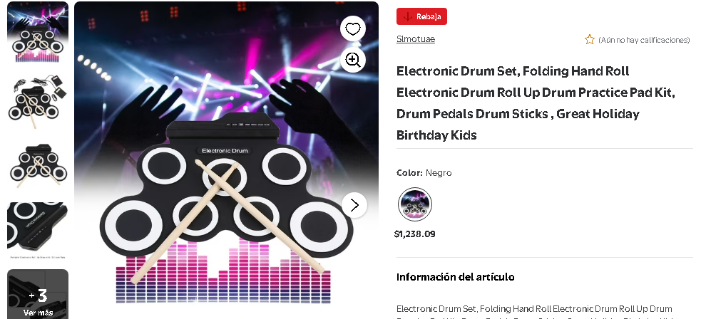

# Tapete MIDI con Arduino Micro

Modificacion de un tapete de bateria tipo "Electronic Drum Set" para convertir sus pads y pedales en un controlador USB MIDI compatible con cualquier DAW, sampler o software que permita mapeo MIDI.

## Resumen

El tapete original necesita +5V para encender su electronica. En esta modificacion, la alimentacion del tapete se comparte desde el `Arduino Micro`, y las salidas de pads/pedales se conectan a entradas digitales del microcontrolador. El firmware lee 9 entradas (`D2` a `D10`) y envia mensajes `noteOn` / `noteOff` por USB MIDI usando la libreria `MIDIUSB`.

## Objetivo del proyecto

- Reutilizar el hardware del tapete original.
- Sustituir el modulo de sonido cerrado por una salida USB MIDI.
- Poder asignar los pads a cualquier instrumento virtual o DAW.
- Dejar documentado el mod para reproducirlo o mejorarlo.

## Estructura

- `src/Tapete/Tapete.ino`: sketch original adaptado para `Arduino Micro`.
- `materials/README.md`: indice de materiales y documentacion auxiliar.
- `materials/bom.md`: lista de componentes y herramientas.
- `materials/schematics/wiring-overview.md`: resumen del conexionado y flujo electrico.
- `materials/images/referencia-producto.png`: imagen de referencia del tapete base.

## Hardware base

- 1 tapete de bateria electronica enrollable.
- 1 `Arduino Micro` o placa compatible con USB nativo.
- Cableado interno para pads y pedales.
- Conexion comun de `GND` entre tapete y Arduino.
- Alimentacion de `+5V` hacia la electronica del tapete.

## Funcionamiento actual del firmware

- Cantidad de entradas: `9`
- Pines usados: `D2` a `D10`
- Canal MIDI en el codigo: `5`
- Canal MIDI visible en la mayoria de los DAW: `6`
- Notas enviadas: `4` a `12`
- Velocidad fija: `120`

## Mapa actual de entradas MIDI

| Entrada fisica | Pin Arduino | Nota MIDI |
| --- | --- | --- |
| Trigger 1 | `D2` | `4` |
| Trigger 2 | `D3` | `5` |
| Trigger 3 | `D4` | `6` |
| Trigger 4 | `D5` | `7` |
| Trigger 5 | `D6` | `8` |
| Trigger 6 | `D7` | `9` |
| Trigger 7 | `D8` | `10` |
| Trigger 8 | `D9` | `11` |
| Trigger 9 | `D10` | `12` |

Nota: en este repo se nombran como `Trigger 1..9` porque el sketch no define aun que entrada corresponde a cada pad o pedal fisico. Esa rotulacion se puede completar facilmente cuando se documente el cableado final.

## Carga del firmware

1. Instala `Arduino IDE` o `arduino-cli`.
2. Asegurate de tener la libreria `MIDIUSB`.
3. Abre `src/Tapete/Tapete.ino`.
4. Selecciona la placa `Arduino Micro`.
5. Compila y carga el sketch.
6. Conecta el dispositivo por USB y verifica que tu DAW lo detecte como dispositivo MIDI.

## Consideraciones electricas

- Comparte siempre el `GND` del tapete y del `Arduino Micro`.
- El `+5V` debe alimentar solo la etapa del tapete que originalmente requiere esa alimentacion.
- No inyectes `5V` directamente a lineas de senal que trabajan a `3.3V`.
- El firmware actual asume que una lectura `HIGH` activa la nota.
- Si tu hardware real dispara al ir a `LOW`, invierte la condicion en el `loop()`.

## Mejoras futuras sugeridas

- Reemplazar el mapeo lineal por un arreglo configurable de notas MIDI.
- Nombrar cada entrada como `kick`, `snare`, `tom`, `hihat`, etc.
- Agregar filtrado o debounce por software.
- Medir si el tapete permite extraer dinamica real o pseudovelocidad.
- Documentar con fotos internas del mod y un esquema electrico mas detallado.
